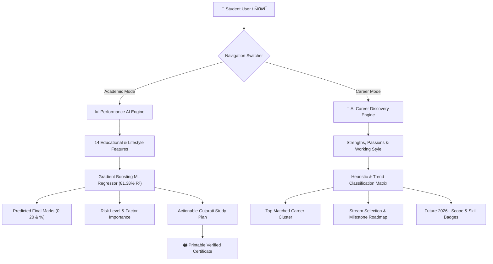

<div align="center">

# 🌌 EduVision AI 3.0
### Intelligent Academic Performance & Multimodal Career Guidance System
**વિદ્યાર્થીની શૈક્ષણિક પ્રગતિ અને ઉજ્જવળ કારકિર્દીને સમજતું AI આધારિત સ્માર્ટ પ્લેટફોર્મ**

[](https://eduvision-ai-3-0.vercel.app)
[](https://github.com/yash-kumar-patel/eduvision-ai-3.0)
[](https://nextjs.org/)
[](https://www.typescriptlang.org/)
[](https://tailwindcss.com/)
[](https://threejs.org/)

<br />

<p align="center">
  <a href="#-key-features">Key Features</a> •
  <a href="#-dual-core-ai-architecture">AI Architecture</a> •
  <a href="#-machine-learning-details">ML Model</a> •
  <a href="#-tech-stack">Tech Stack</a> •
  <a href="#-getting-started">Getting Started</a> •
  <a href="#-the-team">The Team</a>
</p>

---

</div>

## 📌 Overview

**EduVision AI 3.0** is a next-generation, bilingual (Gujarati & English) educational intelligence engine designed for students, educators, and schools. Originally conceptualized and engineered for the **Science Fair 2026**, EduVision AI bridges the gap between machine learning insights and actionable student mentorship.

Unlike conventional reporting tools, EduVision AI combines **predictive academic forecasting** with **personalized AI career pathway discovery**, helping young students identify academic risks early and discover rewarding career fields aligned with their individual passions and market trends.

---

## 🚀 Key Features

<table>
  <tr>
    <td width="50%">
      <h3>🎯 1. Academic Performance AI</h3>
      <ul>
        <li><strong>Predictive Scoring:</strong> Estimates final term performance from 14 behavioural & educational data points.</li>
        <li><strong>Factor Impact Breakdown:</strong> Identifies exact strengths and areas requiring urgent attention.</li>
        <li><strong>Personalized Action Plans:</strong> Actionable Gujarati guidance tailored to each student's study habits.</li>
        <li><strong>Official PDF Certificate:</strong> Printable, high-contrast bilingual evaluation reports.</li>
      </ul>
    </td>
    <td width="50%">
      <h3>🧭 2. Multimodal AI Career Engine</h3>
      <ul>
        <li><strong>Passion & Skill Matching:</strong> Evaluates favorite subjects, creative inclinations, and work preferences.</li>
        <li><strong>Stream Guidance:</strong> Recommends optimal 10th/12th streams (Science, Commerce, Arts, Vocational, IT/AI).</li>
        <li><strong>Trending 2026+ Careers:</strong> Real-time trend discovery in AI, Robotics, Space Tech, Finance, and Design.</li>
        <li><strong>Roadmaps & Colleges:</strong> Step-by-step milestone guides and leading Indian institutes.</li>
      </ul>
    </td>
  </tr>
  <tr>
    <td width="50%">
      <h3>🌌 3. Immersive 3D Space Cosmos UI</h3>
      <ul>
        <li>Interactive <strong>Three.js WebGL particle cosmos</strong> responding smoothly to user interactions.</li>
        <li>Monochrome dark cyberpunk aesthetic with high readability.</li>
        <li>Mac Magnified interactive typography & dock navigation.</li>
      </ul>
    </td>
    <td width="50%">
      <h3>📱 4. Mobile-First & Bilingual</h3>
      <ul>
        <li>Native Gujarati script typography powered by <code>Google Sans</code> & <code>Noto Sans Gujarati</code>.</li>
        <li>Fluid responsive layout across smartphones, tablets, and 4K displays.</li>
        <li>One-question-at-a-time distraction-free questionnaire.</li>
      </ul>
    </td>
  </tr>
</table>

---

## 🧠 Dual-Core AI Architecture



---

## 🔬 Machine Learning Details

The core academic prediction engine utilizes a high-precision **Gradient Boosting Regressor (GBR)** trained on student academic records.

### Model Performance Metrics
| Metric | Value | Significance |
|---|:---:|---|
| **Algorithm** | `GradientBoostingRegressor` | Ensemble of 100+ sequential decision trees |
| **R² Score** | `0.8138` (81.38%) | High variance explanation & predictive confidence |
| **Mean Absolute Error (MAE)** | `±1.18` marks | Extremely close prediction on a 20-point scale |
| **Dataset Size** | 395 Verified Records | Comprehensive student behavioural patterns |

### Key Feature Importance
- **G2 (Second Period Marks):** `80.53%` (Primary trajectory indicator)
- **Absences (School Attendance):** `14.17%` (Critical risk detector)
- **G1 (First Period Marks):** `1.64%` (Foundational benchmark)
- **Study Time, Health & Family Support:** `3.66%` (Holistic lifestyle factors)

---

## 🛠️ Tech Stack

- **Frontend & Framework:** [Next.js 14](https://nextjs.org/) (App Router, Server & Client Components)
- **Language:** [TypeScript 5.0](https://www.typescriptlang.org/)
- **Styling & Design System:** [Tailwind CSS](https://tailwindcss.com/)
- **3D Graphics & Visuals:** [Three.js](https://threejs.org/) (WebGL Starfield & Particle Systems)
- **Icons & Effects:** [Lucide Icons](https://lucide.dev/), [Canvas Confetti](https://www.npmjs.com/package/canvas-confetti)
- **Deployment & Cloud:** [Vercel](https://vercel.com/) (Edge Runtime & Global CDN)

---

## 📂 Project Structure

```bash
eduvision-ai-3.0/
├── app/
│   ├── globals.css            # Global CSS, typography & animation rules
│   ├── layout.tsx             # Root layout with metadata & fonts
│   └── page.tsx               # Main dual-engine experience
├── components/
│   ├── career/                # Career Guidance Engine Components
│   │   ├── CareerHeroInput.tsx
│   │   ├── CareerProcessingAnimation.tsx
│   │   ├── CareerQuestionnaire.tsx
│   │   ├── CareerResultView.tsx
│   │   └── CareerSection.tsx
│   ├── sections/              # Performance Prediction Sections
│   │   ├── OpeningScreen.tsx
│   │   ├── PredictionForm.tsx
│   │   ├── PredictionReveal.tsx
│   │   ├── ResultExplanation.tsx
│   │   ├── GuidanceSection.tsx
│   │   └── ReportSection.tsx
│   └── ui/                    # Reusable Visual & Navigation UI
│       ├── CertificateModal.tsx
│       ├── MacDock.tsx
│       ├── MacMagnifiedText.tsx
│       ├── NavigationSwitch.tsx
│       ├── ScrollReveal.tsx
│       └── ThreeBackground.tsx
├── lib/
│   ├── api.ts                 # ML prediction calculation logic
│   ├── careerEngine.ts        # Comprehensive career matching database
│   └── storage.ts             # Local session & history handling
└── types/                     # TypeScript definitions & data contracts
```

---

## ⚡ Getting Started

Follow these simple steps to run EduVision AI locally on your machine:

### 1. Clone the Repository
```bash
git clone https://github.com/yash-kumar-patel/eduvision-ai-3.0.git
cd eduvision-ai-3.0
```

### 2. Install Dependencies
```bash
npm install
```

### 3. Run Development Server
```bash
npm run dev
```

Open [http://localhost:3000](http://localhost:3000) in your browser to view the application.

### 4. Build for Production
```bash
npm run build
npm run start
```

---

## 👨‍🔬 The Team & Innovators

<div align="center">

### Science Fair Project 2026
**એમ. એમ. કરોડિયા પ્રાથમિક શાળા, તરસાડી કોસંબા (R.S)**

| Student Scientist / બાળવૈજ્ઞાનિક | Student Scientist / બાળવૈજ્ઞાનિક | Project Mentor / માર્ગદર્શક શિક્ષક |
|:---:|:---:|:---:|
| **કૃતાર્થ રોનક બારોટ**<br />(Krutharth Ronak Barot) | **અંશ કિરણભાઈ પ્રજાપતિ**<br />(Ansh Kiranbhai Prajapati) | **શ્રી મનોજભાઈ પરમાર**<br />(Shri Manojbhai Parmar) |

</div>

---

## 📄 License

This project is licensed under the [MIT License](LICENSE) — open for educational research, student innovation, and scientific advancement.

<div align="center">

**Made with ❤️ for young Gujarati innovators & future scientists.**

⭐ Star this repository if you find it helpful!

</div>
