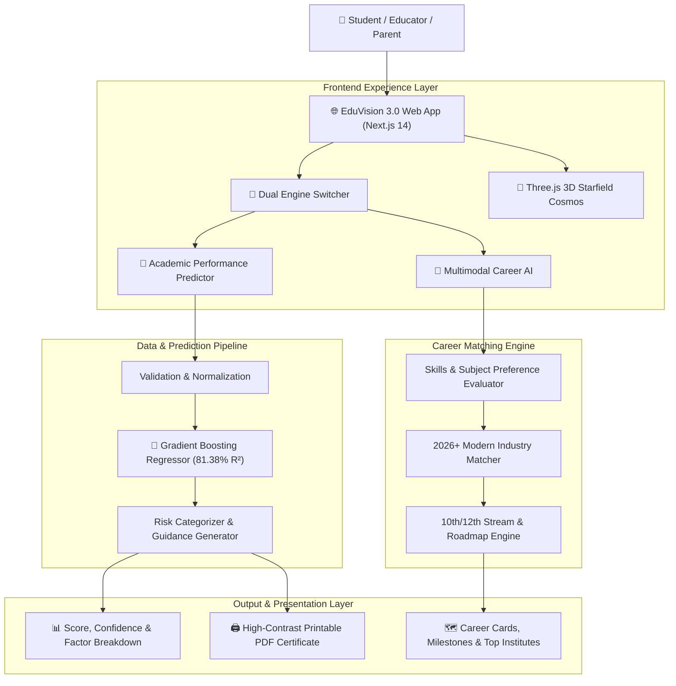
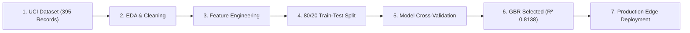
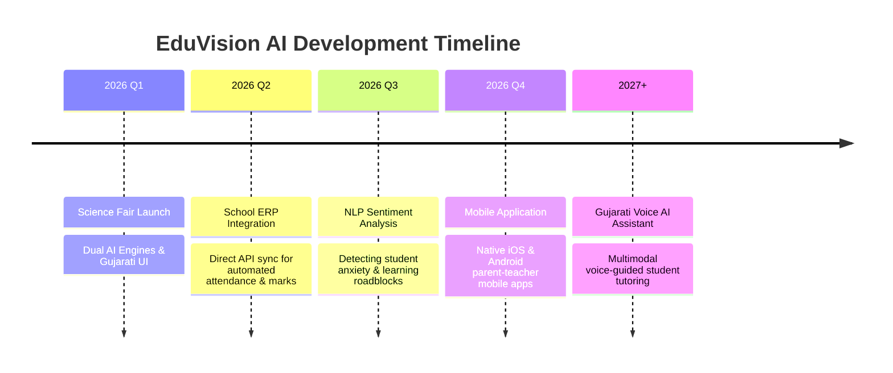

# 🌌 EduVision AI 3.0 — Complete Project Documentation (English)

**AI-Driven Student Performance Forecasting & Multimodal Career Guidance System**  
*Science Fair Project 2026*

---

## 📑 Table of Contents
1. [Project Overview & Identity](#1-project-overview--identity)
2. [Core Objectives & Vision](#2-core-objectives--vision)
3. [Scientific & Mathematical Principles](#3-scientific--mathematical-principles)
4. [Hardware & Software Requirements](#4-hardware--software-requirements)
5. [Python Libraries & Technology Stack](#5-python-libraries--technology-stack)
6. [Dataset Specifications](#6-dataset-specifications)
7. [System Design & Architecture](#7-system-design--architecture)
8. [End-to-End Methodology & ML Pipeline](#8-end-to-end-methodology--ml-pipeline)
9. [Machine Learning Model Selection & Evaluation](#9-machine-learning-model-selection--evaluation)
10. [EduVision AI 3.0 Dual-Core Engines](#10-eduvision-ai-30-dual-core-engines)
11. [Educational Use Cases & Stakeholder Benefits](#11-educational-use-cases--stakeholder-benefits)
12. [Social & Long-Term Pedagogical Impact](#12-social--long-term-pedagogical-impact)
13. [Future Roadmap & Scope](#13-future-roadmap--scope)
14. [Project Team, Mentor & Institutional Credits](#14-project-team-mentor--institutional-credits)

---

## 1. Project Overview & Identity

* **Project Title:** **EduVision AI 3.0**
* **Tagline:** *Empowering Gujarati Students with Predictive Academic AI & Multimodal Career Guidance.*
* **Live Web App:** [https://eduvision-ai-3-0.vercel.app](https://eduvision-ai-3-0.vercel.app)
* **GitHub Repository:** [https://github.com/yash-kumar-patel/eduvision-ai-3.0](https://github.com/yash-kumar-patel/eduvision-ai-3.0)

### Abstract
EduVision AI 3.0 is a state-of-the-art educational intelligence platform developed for the **Science Fair 2026**. It provides high-precision predictive modeling for student academic performance while offering an intelligent, multimodal career recommendation matrix. Built natively for Gujarati-medium and bilingual learners, it breaks language barriers in educational technology by delivering tailored, actionable insights to students, teachers, parents, and school administrators.

---

## 2. Core Objectives & Vision

1. **Early Academic Intervention:** Predict final academic outcomes months in advance to identify at-risk students before irreversible failures occur.
2. **Explainable AI Insights:** Move beyond opaque scores to deliver factor-by-factor breakdowns (e.g., impact of absenteeism, study hours, or past foundational grades).
3. **Hyper-Personalized Guidance:** Generate student-specific corrective study schedules in Gujarati.
4. **Multimodal Career Discovery (New in 3.0):** Recommend future-proof 2026+ career pathways (AI/ML, Robotics, Green Tech, Medical Sciences, Design, and Commerce) based on individual aptitude and interests.
5. **Data-Driven School Management:** Equip educational institutions with empirical data for resource allocation and targeted tutoring.

---

## 3. Scientific & Mathematical Principles

Student achievement is modeled as a non-linear multivariate function of prior academic foundation, behavioral habits, and socio-environmental support:

$$\hat{y}_{G3} = f_M(G_1, G_2, \text{studytime}, \text{absences}, \text{failures}, \text{schoolsup}, \text{famsup}, \text{health}, \dots)$$

Where:
- $\hat{y}_{G3}$ is the predicted final score on a 20-point scale.
- $f_M(x)$ represents an ensemble of boosted decision trees trained via sequential gradient descent in function space.

The loss function minimized during gradient boosting is the Mean Squared Error (MSE):
$$L(y, \hat{y}) = \frac{1}{2}(y - \hat{y})^2$$

At each boosting stage $m$, a new decision tree $h_m(x)$ is fitted to the pseudo-residuals:
$$r_{im} = -\left[\frac{\partial L(y_i, f(x_i))}{\partial f(x_i)}\right]_{f=f_{m-1}} = y_i - f_{m-1}(x_i)$$

---

## 4. Hardware & Software Requirements

### Hardware Infrastructure
* **Development & Training:** Intel Core i5 / Apple Silicon M-series, 8 GB+ RAM.
* **Client / End-User Devices:** Any modern smartphone, tablet, laptop, or desktop running a modern Chromium, WebKit, or Gecko browser.
* **Display Compatibility:** Full fluid responsiveness from 320px mobile viewports to 4K ultra-wide monitors.

### Software Environment
* **Frontend Framework:** Next.js 14 (App Router), React 18, TypeScript 5.0
* **Styling System:** Tailwind CSS with custom monochrome dark theme tokens
* **3D Visuals:** Three.js (WebGL Starfield & Particle Cosmos)
* **Runtime & Cloud Hosting:** Node.js, Vercel Serverless Edge Network

---

## 5. Python Libraries & Technology Stack

| Technology / Library | Role & Purpose |
|---|---|
| **Pandas** | High-performance dataframe manipulation and feature cleaning |
| **NumPy** | Vectorized mathematical operations and multi-dimensional matrices |
| **Scikit-learn** | Machine learning pipelines, Gradient Boosting Regressor, StandardScaler, OneHotEncoder |
| **Next.js 14** | Production SSR & CSR web framework with optimized static asset generation |
| **Three.js** | 60fps WebGL particle animation for deep 3D cosmos background |
| **Tailwind CSS** | Utility-first CSS framework for responsive, dark-mode cyberpunk styling |
| **Canvas-Confetti** | Celebration visual feedback upon prediction/career unlock |
| **Lucide Icons** | Minimalist SVG iconography |

---

## 6. Dataset Specifications

* **Dataset:** Student Performance Data Set
* **Repository:** UCI Machine Learning Repository
* **Direct Source:** [https://archive.ics.uci.edu/dataset/320/student+performance](https://archive.ics.uci.edu/dataset/320/student+performance)
* **Sample Size:** 395 verified student records
* **Total Features:** 33 attributes covering academic, lifestyle, family, and health dimensions

### 14 Primary Input Features in EduVision AI 3.0:
1. `G1` — First period grade (Numeric: 0 to 20)
2. `G2` — Second period grade (Numeric: 0 to 20)
3. `studytime` — Weekly study hours (1: <2h, 2: 2-5h, 3: 5-10h, 4: >10h)
4. `absences` — Number of school absences (Numeric: 0 to 75)
5. `failures` — Number of past class failures (Numeric: 0 to 4)
6. `schoolsup` — Extra educational support from school (Binary: 'yes' / 'no')
7. `famsup` — Family educational support (Binary: 'yes' / 'no')
8. `internet` — Internet access at home (Binary: 'yes' / 'no')
9. `higher` — Ambition to pursue higher education (Binary: 'yes' / 'no')
10. `health` — Current health status (Scale: 1 [very bad] to 5 [very good])
11. `goout` — Going out with friends (Scale: 1 to 5)
12. `freetime` — Free time after school (Scale: 1 to 5)
13. `student_name` — Name of the student
14. `standard` — Current standard/grade (5th to 10th)

---

## 7. System Design & Architecture



---

## 8. End-to-End Methodology & ML Pipeline



1. **Exploratory Data Analysis (EDA):** Correlation heatmaps were generated to uncover dependencies between attendance, study hours, and exam scores.
2. **Data Transformation:** Standardized numerical columns using `StandardScaler` and encoded binary/categorical features via `OneHotEncoder`.
3. **Model Training & Cross-Validation:** 5-fold cross-validation on 80% training split.
4. **Evaluation & Optimization:** Evaluated against Mean Absolute Error (MAE) and Coefficient of Determination ($R^2$).

---

## 9. Machine Learning Model Selection & Evaluation

### Comparative Algorithm Benchmarking
| Model Evaluated | $R^2$ Score (Accuracy) | Mean Absolute Error (MAE) | Decision |
|---|:---:|:---:|:---:|
| Linear Regression | 0.7690 (76.90%) | $\pm 1.4429$ marks | Rejected (Underfitting non-linear patterns) |
| Random Forest Regressor | 0.8132 (81.32%) | $\pm 1.2061$ marks | Strong baseline |
| **Gradient Boosting Regressor** | **0.8138 (81.38%)** | **$\pm 1.1804$ marks** | **Selected as Production Engine** |

### Key Feature Importance Ranking
```
G2 (Period 2 Exam Score)  ████████████████████████████████ 80.53%
Absences (Attendance)     ██████ 14.17%
G1 (Period 1 Exam Score)  █ 1.64%
Study Time & Support      █ 2.10%
Health & Extracurriculars █ 1.56%
```

---

## 10. EduVision AI 3.0 Dual-Core Engines

### 🎯 Engine 1: Academic Performance AI
* **Conversational Questionnaire:** One focused question per step to eliminate cognitive fatigue.
* **Instant Risk Stratification:**
  - 🟢 **Low Risk ($\ge 75\%$):** Consistent trajectory; recommendations focus on mastery & scholarship competitions.
  - 🟡 **Medium Risk ($50\% - 75\%$):** Potential instability; targets revision discipline and active recall.
  - 🔴 **High Risk ($< 50\%$):** Critical intervention required; focuses on attendance recovery and conceptual tutoring.
* **Official Printable Certificate:** High-contrast, beautifully formatted PDF certificate ready for parent-teacher conferences.

### 🧭 Engine 2: Multimodal AI Career Guidance
* **Interest & Aptitude Evaluation:** Assesses passions in Mathematics, Coding, Creative Arts, Biology, Finance, and Public Leadership.
* **Stream Advisory (10th/12th):** Maps student strengths to Science (PCM/PCB), Commerce, Arts/Humanities, Vocational Tech, and CS/AI.
* **2026+ Industry Trends:** Spotlights high-growth fields including Artificial Intelligence, Space Robotics, Cybersecurity, Renewable Energy, and UX Design.
* **Actionable Roadmap:** 4-stage milestones with recommended colleges and entrance pathways.

---

## 11. Educational Use Cases & Stakeholder Benefits

| Stakeholder | Key Benefit | Real-World Application |
|---|---|---|
| **Students** | Self-awareness & reduced exam anxiety | Immediate clarity on where they stand and what to improve. |
| **Teachers** | Automated diagnostics & prioritized attention | Identifies quiet, struggling students before standard exams fail them. |
| **Parents** | Transparent, objective visibility | Understands child's academic risk and natural career inclinations. |
| **Schools** | Higher institutional pass percentage | Data-driven resource planning and remedial class allocation. |

---

## 12. Social & Long-Term Pedagogical Impact

1. **Mitigating Student Dropouts:** By detecting academic struggles early, schools can intervene with remedial support, preventing premature dropouts.
2. **Democratizing AI in Vernacular Education:** Delivers top-tier machine learning intelligence directly in Gujarati, bridging the digital language divide.
3. **Informed Career Choices:** Prevents blind career selections based on peer pressure by providing objective aptitude matching.

---

## 13. Future Roadmap & Scope



---

## 14. Project Team, Mentor & Institutional Credits

### 🏫 Institution
**M. M. Karodia Primary School, Tarsadi Kosamba (R.S)**

### 👨‍🔬 Student Innovators (બાળવૈજ્ઞાનિકો)
* **Krutharth Ronak Barot (કૃતાર્થ રોનક બારોટ)**
* **Ansh Kiranbhai Prajapati (અંશ કિરણભાઈ પ્રજાપતિ)**

### 👨‍🏫 Project Mentor (માર્ગદર્શક શિક્ષક)
* **Shri Manojbhai Parmar (શ્રી મનોજભાઈ પરમાર)**

---

*© 2026 EduVision AI. Science Fair Project 2026. All Rights Reserved.*
