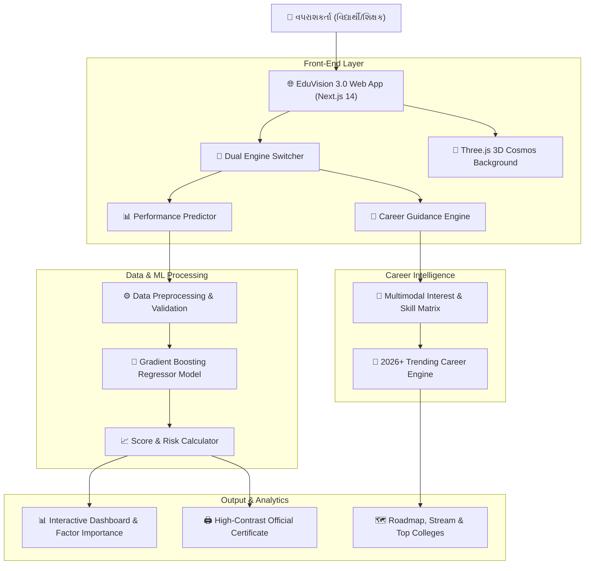

# 🌌 EduVision AI 3.0 — સંપૂર્ણ પ્રોજેક્ટ દસ્તાવેજીકરણ (Gujarati Documentation)

**AI આધારિત વિદ્યાર્થી પ્રદર્શન આગાહી અને બહુઆયામી કારકિર્દી માર્ગદર્શન પ્રણાલી**  
*સાયન્સ ફેર પ્રોજેક્ટ ૨૦૨૬ (Science Fair Project 2026)*

---

## 📑 અનુક્રમણિકા (Table of Contents)
1. [કૃતિનું નામ અને પરિચય](#૧-કૃતિનું-નામ-અને-પરિચય)
2. [પ્રોજેક્ટનો મુખ્ય હેતુ](#૨-પ્રોજેક્ટનો-મુખ્ય-હેતુ)
3. [વૈજ્ઞાનિક સિદ્ધાંત](#૩-વૈજ્ઞાનિક-સિદ્ધાંત)
4. [જરૂરી સાધનો (હાર્ડવેર અને સોફ્ટવેર)](#૪-જરૂરી-સાધનો-હાર્ડવેર-અને-સોફ્ટવેર)
5. [પાયથોન લાઇબ્રેરીઓ અને ટેકનોલોજી સ્ટેક](#૫-પાયથોન-લાઇબ્રેરીઓ-અને-ટેકનોલોજી-સ્ટેક)
6. [ડેટાસેટ સમૂહ (Dataset Information)](#૬-ડેટાસેટ-સમૂહ-dataset-information)
7. [સંપૂર્ણ સિસ્ટમ રચના અને આર્કિટેક્ચર](#૭-સંપૂર્ણ-સિસ્ટમ-રચના-અને-આર્કિટેક્ચર)
8. [કાર્યપદ્ધતિ (Methodology) અને ML પાઇપલાઇન](#૮-કાર્યપદ્ધતિ-methodology-અને-ml-પાઇપલાઇન)
9. [મોડેલ પસંદગી અને ચોકસાઈનું મૂલ્યાંકન](#૯-મોડેલ-પસંદગી-અને-ચોકસાઈનું-મૂલ્યાંકન)
10. [EduVision AI 3.0 ના ડ્યુઅલ એન્જિન (મુખ્ય વિશેષતાઓ)](#૧૦-eduvision-ai-30-ના-ડ્યુઅલ-એન્જિન-મુખ્ય-વિશેષતાઓ)
11. [શિક્ષણ ક્ષેત્રમાં ઉપયોગ અને ફાયદા](#૧૧-શિક્ષણ-ક્ષેત્રમાં-ઉપયોગ-અને-ફાયદા)
12. [સમાજ અને શિક્ષણ ક્ષેત્ર પર દીર્ઘકાલીન અસર](#૧૨-સમાજ-અને-શિક્ષણ-ક્ષેત્ર-પર-દીર્ઘકાલીન-અસર)
13. [ભવિષ્યની યોજના (Future Scope)](#૧૩-ભવિષ્યની-યોજના-future-scope)
14. [પ્રોજેક્ટ ટીમ, માર્ગદર્શક અને શાળા પરિચય](#૧૪-પ્રોજેક્ટ-ટીમ-માર્ગદર્શક-અને-શાળા-પરિચય)

---

## ૧. કૃતિનું નામ અને પરિચય

* **કૃતિનું નામ:** **EduVision AI 3.0**
* **ટેગલાઇન:** *વિદ્યાર્થીની શૈક્ષણિક પ્રગતિને સમજતું અને ભવિષ્યની દિશા બતાવતું AI આધારિત સ્માર્ટ પ્લેટફોર્મ.*
* **વેબસાઇટ લિંક:** [https://eduvision-ai-3-0.vercel.app](https://eduvision-ai-3-0.vercel.app)
* **GitHub Repository:** [https://github.com/yash-kumar-patel/eduvision-ai-3.0](https://github.com/yash-kumar-patel/eduvision-ai-3.0)

### સંક્ષિપ્ત પરિચય
EduVision AI 3.0 એ એક અત્યાધુનિક, દ્વિભાષી (ગુજરાતી અને અંગ્રેજી) વેબ-આધારિત શૈક્ષણિક ઇન્ટેલિજન્સ સિસ્ટમ છે. આ પ્લેટફોર્મ વિદ્યાર્થીના ૧૪ જેટલા મહત્વપૂર્ણ શૈક્ષણિક અને જીવનશૈલી પરિબળોનું વિશ્લેષણ કરીને અંતિમ વાર્ષિક પરીક્ષાના ગુણની સચોટ આગાહી કરે છે, જોખમ સ્તર નક્કી કરે છે અને વ્યક્તિગત સુધારણા યોજના આપે છે. આવૃત્તિ 3.0 માં નવું **AI Career Guidance Engine** ઉમેરવામાં આવ્યું છે, જે વિદ્યાર્થીના રસ, કૌશલ્ય અને આધુનિક પ્રવાહો (૨૦૨૬+) મુજબ શ્રેષ્ઠ કારકિર્દી વિકલ્પો અને રોડમેપ સૂચવે છે.

---

## ૨. પ્રોજેક્ટનો મુખ્ય હેતુ

1. **વહેલી ઓળખ (Early Identification):** પરીક્ષાના મહિનાઓ પહેલાં નબળા અથવા જોખમ ધરાવતા વિદ્યાર્થીઓની ઓળખ કરવી જેથી સમયસર સુધારો થઈ શકે.
2. **આગાહી અને જોખમ વિશ્લેષણ:** Machine Learning દ્વારા સચોટ માર્ક્સ અને Performance Risk (High / Medium / Low) નું વિશ્લેષણ કરવું.
3. **વ્યક્તિગત માર્ગદર્શન:** સામાન્ય સલાહ આપવાને બદલે વિદ્યાર્થીના ચોક્કસ નબળા પરિબળ (જેમ કે અભ્યાસ સમય, ગેરહાજરી, પુનરાવર્તન) મુજબ ગુજરાતીમાં માર્ગદર્શન આપવું.
4. **કારકિર્દી દિશા નિર્ધારણ (Career AI):** ધોરણ ૧૦ અને ૧૨ પછી કયો પ્રવાહ (Science, Commerce, Arts, AI/Robotics, વગેરે) પસંદ કરવો તેનું વિજ્ઞાન-આધારિત માર્ગદર્શન પૂરું પાડવું.
5. **ડેટા-આધારિત નિર્ણય શક્તિ:** શિક્ષકો, વાલીઓ અને શાળાઓને અનુમાનને બદલે ડેટા અને પુરાવા આધારિત શૈક્ષણિક નિર્ણયો લેવામાં મદદ કરવી.

---

## ૩. વૈજ્ઞાનિક સિદ્ધાંત

વિદ્યાર્થીનું શૈક્ષણિક પરિણામ માત્ર એક પરીક્ષાના દિવસનું પરિણામ નથી, પરંતુ તે તેના દૈનિક અભ્યાસ સમય, અગાઉની પરીક્ષાઓનો પાયો, શાળામાં હાજરી, કુટુંબ સહાય અને મનોવૈજ્ઞાનિક સ્વાસ્થ્ય જેવા બહુવિધ પરિબળોનું સંયુક્ત પરિણામ છે.

$$\text{Final Grade } (G_3) = f(G_1, G_2, \text{StudyTime}, \text{Absences}, \text{Failures}, \text{Support}, \dots)$$

જો આ ઐતિહાસિક સંબંધોને મશીન લર્નિંગ અલ્ગોરિધમ દ્વારા પ્રશિક્ષિત (train) કરવામાં આવે, તો તે આવનારી પરીક્ષાના પરિણામની ઉચ્ચ ચોકસાઈ સાથે આગાહી કરી શકે છે.

---

## ૪. જરૂરી સાધનો (હાર્ડવેર અને સોફ્ટવેર)

### હાર્ડવેર (Hardware)
* કમ્પ્યુટર / લેપટોપ (Intel i3/i5/Apple Silicon અથવા સમકક્ષ, 8GB+ RAM)
* ઇન્ટરનેટ કનેક્શન (Cloud Deployment અને API એક્સેસ માટે)
* સ્માર્ટફોન / ટેબ્લેટ (મોબાઇલ રિસ્પોન્સિવ ટેસ્ટિંગ માટે)

### સોફ્ટવેર અને એન્વાયર્નમેન્ટ (Software)
* **પ્રોગ્રામિંગ ભાષાઓ:** TypeScript / JavaScript, Python 3.10+
* **ફ્રન્ટએન્ડ ફ્રેમવર્ક:** Next.js 14 (App Router), React 18, Tailwind CSS
* **૩D ગ્રાફિક્સ એન્જિન:** Three.js (WebGL Starfield Cosmos Background)
* **કોડ એડિટર:** Visual Studio Code, Jupyter Notebook
* **ક્લાઉડ પ્લેટફોર્મ:** Vercel (Edge Network & Serverless Hosting)

---

## ૫. પાયથોન લાઇબ્રેરીઓ અને ટેકનોલોજી સ્ટેક

| લાઇબ્રેરી / ટૂલ | મુખ્ય કાર્ય અને ઉપયોગિતા |
|---|---|
| **Pandas** | ડેટાસેટનું સંચાલન, ડેટાફ્રેમ હેન્ડલિંગ અને સફાઈ (Data Cleaning) |
| **NumPy** | બહુપરિમાણીય ગાણિતિક ગણતરીઓ અને મેટ્રિક્સ ઓપરેશન્સ |
| **Scikit-learn** | મોડેલ તાલીમ, ડેટા પાઇપલાઇન્સ, StandardScaler અને Encoders |
| **Next.js 14** | મોર્ડન સર્વર-સાઇડ રેન્ડરિંગ અને ક્લાયન્ટ કોમ્પોનન્ટ આર્કિટેક્ચર |
| **Tailwind CSS** | મોનોક્રોમ ડાર્ક સાયબરપંક રિસ્પોન્સિવ યુઝર ઇન્ટરફેસ |
| **Three.js** | ઇન્ટરેક્ટિવ 3D કોસ્મોસ સ્પેસ પાર્ટિકલ બેકગ્રાઉન્ડ |
| **Canvas-Confetti** | પરિણામ અનલોક પર ઉત્સવપૂર્ણ એનિમેશન |
| **Lucide React** | મોર્ડન અને લાઇટવેઇટ આઇકોન્સ |

---

## ૬. ડેટાસેટ સમૂહ (Dataset Information)

* **ડેટાસેટનું નામ:** Student Performance Data Set
* **સ્ત્રોત:** યુસીઆઈ મશીન લર્નિંગ રિપોઝિટરી (UCI Machine Learning Repository)
* **સ્ત્રોત લિંક:** [https://archive.ics.uci.edu/dataset/320/student+performance](https://archive.ics.uci.edu/dataset/320/student+performance)
* **કુલ વિદ્યાર્થી રેકોર્ડ્સ:** ૩૯૫ વિદ્યાર્થીઓ (395 Student Records)
* **કુલ પરિબળો (Features):** ૩૩ પરિબળો (શિક્ષણ, વર્તન, કૌટુંબિક સહાય અને આરોગ્ય સંબંધિત)

### મુખ્ય ૧૪ લક્ષણો (Features Used in EduVision AI 3.0):
1. `G1` — પ્રથમ પરીક્ષાના ગુણ (૦ થી ૨૦)
2. `G2` — બીજી પરીક્ષાના ગુણ (૦ થી ૨૦)
3. `studytime` — દૈનિક અભ્યાસ સમય (૧ = <૨ કલાક, ૨ = ૨-૫ કલાક, ૩ = ૫-૧૦ કલાક, ૪ = >૧૦ કલાક)
4. `absences` — સત્ર દરમિયાન ગેરહાજરીના દિવસો (૦ થી ૭૫)
5. `failures` — અગાઉ નાપાસ થયેલા વિષયોની સંખ્યા (૦ થી ૪)
6. `schoolsup` — શાળામાંથી વિશેષ વધારાની મદદ (હા / ના)
7. `famsup` — પરિવાર તરફથી શૈક્ષણિક ટેકો (હા / ના)
8. `internet` — ઘરે ઇન્ટરનેટ કનેક્ટિવિટી (હા / ના)
9. `higher` — ઉચ્ચ અભ્યાસ (કોલેજ/ડિગ્રી) કરવાની મહેચ્છા (હા / ના)
10. `health` — વર્તમાન શારીરિક સ્વાસ્થ્ય સ્તર (૧ = નબળું થી ૫ = ઉત્તમ)
11. `goout` — મિત્રો સાથે બહાર સમય વિતાવવો (૧ થી ૫)
12. `freetime` — શાળા બાદ નવરાશનો સમય (૧ થી ૫)
13. `student_name` — વિદ્યાર્થીનું નામ
14. `standard` — ધોરણ (૫ થી ૧૦)

---

## ૭. સંપૂર્ણ સિસ્ટમ રચના અને આર્કિટેક્ચર



---

## ૮. કાર્યપદ્ધતિ (Methodology) અને ML પાઇપલાઇન

1. **ડેટા સંગ્રહ અને શુદ્ધિકરણ (Data Collection & Cleaning):**
   - અસંગત મૂલ્યો અને ગુમ થયેલ ડેટા (missing values) નું નિવારણ.
2. **સંશોધનાત્મક વિશ્લેષણ (EDA - Exploratory Data Analysis):**
   - વિવિધ પરિબળો વચ્ચેનો સંબંધ (Correlation Matrix) તપાસવામાં આવ્યો.
3. **લક્ષણ એન્જિનિયરિંગ (Feature Transformation):**
   - શ્રેણીબદ્ધ ચલો (Categorical variables) માટે `OneHotEncoder`.
   - સંખ્યાત્મક ચલો (Numerical values) માટે `StandardScaler`.
4. **ડેટા વિભાજન (Train-Test Split):**
   - ૮૦% તાલીમ ડેટા (Training Data) અને ૨૦% પરીક્ષણ ડેટા (Testing Data).
5. **મોડેલ ટ્રેનિંગ અને ટ્યુનિંગ:**
   - Linear Regression, Random Forest Regressor અને Gradient Boosting Regressor વચ્ચે તુલનાત્મક પરીક્ષણ.
6. **ડિપ્લોયમેન્ટ:**
   - ક્લાઉડ એજ સર્વરલેસ નેટવર્ક પર હોસ્ટિંગ.

---

## ૯. મોડેલ પસંદગી અને ચોકસાઈનું મૂલ્યાંકન

વિવિધ મશીન લર્નિંગ મોડેલોનું સઘન મૂલ્યાંકન કરવામાં આવ્યું:

| અલ્ગોરિધમ (Model) | $R^2$ સ્કોર (ચોકસાઈ) | MAE (સરેરાશ ભૂલ) | નિર્ણય |
|---|:---:|:---:|:---:|
| Linear Regression | ૦.૭૬૯૦ (૭૬.૯%) | ± ૧.૪૪૨૯ માર્ક્સ | નકારવામાં આવ્યું |
| Random Forest Regressor | ૦.૮૧૩૨ (૮૧.૩૨%) | ± ૧.૨૦૬૧ માર્ક્સ | સારો વિકલ્પ |
| **Gradient Boosting Regressor** | **૦.૮૧૩૮ (૮૧.૩૮%)** | **± ૧.૧૮૦૪ માર્ક્સ** | **શ્રેષ્ઠ પસંદગી (Final Model)** |

> **શા માટે Gradient Boosting Regressor પસંદ કરવામાં આવ્યું?**  
> ગ્રેડિયન્ટ બૂસ્ટિંગ મોડેલ ૧૦૦ થી વધુ નિર્ણાયક વૃક્ષો (Decision Trees) ની શ્રેણી બનાવે છે. દરેક નવું વૃક્ષ અગાઉના વૃક્ષની ભૂલોમાંથી શીખીને પોતાની જાતને સુધારે છે. આથી તે વિદ્યાર્થીના જટિલ શૈક્ષણિક વર્તનને સૌથી સચોટ રીતે સમજી શકે છે.

### પરિબળોનું મહત્વ (Feature Importance Breakdown)
* **G2 (દ્વિતીય પરીક્ષાના ગુણ):** `૮૦.૫૩%`
* **Absences (ગેરહાજરી):** `૧૪.૧૭%`
* **G1 (પ્રથમ પરીક્ષાના ગુણ):** `૧.૬૪%`
* **અન્ય પરિબળો (અભ્યાસ સમય, સહાય, સ્વાસ્થ્ય):** `૩.૬૬%`

---

## ૧૦. EduVision AI 3.0 ના ડ્યુઅલ એન્જિન (મુખ્ય વિશેષતાઓ)

### 🎯 ૧. એકેડેમિક પરફોર્મન્સ પ્રિડિક્ટર (Academic Performance AI)
* **ક્રમશઃ પ્રશ્નાવલિ:** એક સમયે એક જ પ્રશ્ન પૂછતી સાહજિક અને સરળ ડિઝાઇન.
* **ઇન્સ્ટન્ટ રિસ્ક લેબલિંગ:** 
  - 🟢 **ઓછું જોખમ (Low Risk):** ઉત્કૃષ્ટ પ્રદર્શન (૭૫% થી વધુ).
  - 🟡 **મધ્યમ જોખમ (Medium Risk):** સરેરાશ પ્રદર્શન (૫૦% થી ૭૫%), સુધારણાની તક.
  - 🔴 **ઉચ્ચ જોખમ (High Risk):** ૫૦% થી ઓછા ગુણ, ત્વરિત વ્યક્તિગત ધ્યાન જરૂરી.
* **ગુજરાતી અભ્યાસ સલાહ:** ચોક્કસ નબળાઈઓને ધ્યાનમાં રાખીને સુધારાત્મક પગલાં.
* **પ્રમાણપત્ર જનરેશન:** એક ક્લિક પર વિદ્યાર્થીનું સત્તાવાર પ્રદર્શન પ્રમાણપત્ર PDF સ્વરૂપે પ્રિન્ટ થઈ શકે છે.

### 🧭 ૨. મલ્ટીમોડલ AI કારકિર્દી માર્ગદર્શન (AI Career Guidance Engine)
* **રસ અને કૌશલ્ય આધારિત વિશ્લેષણ:** ગણિત, વિજ્ઞાન, કળા, કોડિંગ, ટેકનોલોજી કે લીડરશીપ ક્ષેત્રનું મુલ્યાંકન.
* **ધોરણ ૧૦/૧૨ પ્રવાહ પસંદગી:** Science (PCM/PCB), Commerce, Arts/Humanities, Diploma/ITI, AI/CS.
* **૨૦૨૬+ આધુનિક પ્રવાહો:** AI એન્જિનિયરિંગ, રોબોટિક્સ, સાયબર સિક્યોરિટી, સ્પેસ સાયન્સ, ડેટા સાયન્સ અને ડિજિટલ ડિઝાઇનિંગ.
* **રોડમેપ અને સંસ્થાઓ:** કારકિર્દીના તબક્કા અને દેશની ટોચની કોલેજોની યાદી.

---

## ૧૧. શિક્ષણ ક્ષેત્રમાં ઉપયોગ અને ફાયદા

### 👨‍🎓 વિદ્યાર્થીઓ માટે:
* પોતાની શક્તિઓ અને નબળાઈઓનું સ્વ-મૂલ્યાંકન.
* પરીક્ષાના તણાવમાં ઘટાડો અને આત્મવિશ્વાસમાં વધારો.
* ભવિષ્યના લક્ષ્યો માટે યોગ્ય શૈક્ષણિક અને કારકિર્દી માર્ગદર્શન.

### 👩‍🏫 શિક્ષકો માટે:
* વર્ગખંડમાં નબળા વિદ્યાર્થીઓની વહેલી ઓળખ.
* દરેક વિદ્યાર્થી પર વ્યક્તિગત ધ્યાન આપવાની સરળતા.
* વહીવટી બોજમાં ઘટાડો અને ડેટા-આધારિત વર્ગ આયોજન.

### 👨‍👩‍👧‍👦 વાલીઓ માટે:
* બાળકની શૈક્ષણિક પ્રગતિ વિશે પારદર્શક માહિતી.
* કયા વિષય કે ક્ષેત્રમાં બાળકની રુચિ છે તેની સ્પષ્ટ સમજ.
* બાળકના ઉજ્જવળ ભવિષ્ય માટે યોગ્ય સહયોગ.

### 🏫 શાળાઓ અને સંસ્થાઓ માટે:
* સંસ્થાના વાર્ષિક પરિણામો અને પાસિંગ રેશિયોમાં નોંધપાત્ર સુધારો.
* ડેટા-ડ્રિવેન શિક્ષણ પદ્ધતિનો સફળ અમલ.
* આધુનિક AI ટેકનોલોજી અપનાવવામાં અગ્રણી સ્થાન.

---

## ૧૨. સમાજ અને શિક્ષણ ક્ષેત્ર પર દીર્ઘકાલીન અસર

```
┌─────────────────────────────────────────────────────────────┐
│                 EduVision AI ની સમાજ પર અસર                 │
├──────────────────────────────┬──────────────────────────────┤
│       વિદ્યાર્થી સ્તરે       │        સંસ્થાકીય સ્તરે       │
│  • વહેલી ચેતવણીથી ડ્રોપઆઉટ   │  • શાળાના પરિણામોમાં સુધારો   │
│    દરમાં ઘટાડો               │  • શિક્ષકોના સમયની બચત        │
│  • યોગ્ય કારકિર્દીની પસંદગી   │  • સમાન શૈક્ષણિક તકો         │
└──────────────────────────────┴──────────────────────────────┘
```

1. **ડ્રોપઆઉટ દરમાં ઘટાડો:** છેલ્લી ઘડીએ નાપાસ થવાના ડરથી શાળા છોડતા વિદ્યાર્થીઓને અગાઉથી મદદ મળી રહે છે.
2. **શિક્ષણનું લોકશાહીકરણ:** મોંઘા કાઉન્સેલિંગ વગર છેવાડાના ગામડાંના સરકારી શાળાના બાળકોને પણ વિશ્વસ્તરીય AI માર્ગદર્શન મળે છે.
3. **માતૃભાષામાં AI નો ઉપયોગ:** અંગ્રેજીના અવરોધ વગર ગુજરાતી ભાષામાં AI ટેકનોલોજીનો સીધો લાભ મળે છે.

---

## ૧૩. ભવિષ્યની યોજના (Future Scope)

1. **School ERP સિસ્ટમ સાથે API સંકલન:** શાળાના સોફ્ટવેર સાથે સીધું કનેક્શન જેથી મેન્યુઅલ ડેટા એન્ટ્રીની જરૂર ન રહે.
2. **NLP આધારિત સેન્ટિમેન્ટ એનાલિસિસ:** વિદ્યાર્થીના લખાણ અને પ્રતિભાવો પરથી માનસિક તણાવ કે ચિંતા ઓળખવી.
3. **વાલીઓ માટે મોબાઇલ એપ (Android/iOS):** રીઅલ-ટાઇમ એલર્ટ્સ અને માસિક પ્રગતિ સૂચકાંકો.
4. **AI વોઇસ & ચેટ સહાયક (Voice Assistant):** વિદ્યાર્થીઓ પોતાની ભાષામાં બોલીને AI સાથે વાતચીત કરી શકે.

---

## ૧૪. પ્રોજેક્ટ ટીમ, માર્ગદર્શક અને શાળા પરિચય

### 🏫 સંસ્થા
**એમ. એમ. કરોડિયા પ્રાથમિક શાળા, તરસાડી કોસંબા (R.S)**

### 👨‍🔬 બાળવૈજ્ઞાનિકો (Student Scientists)
* **કૃતાર્થ રોનક બારોટ (Krutharth Ronak Barot)**
* **અંશ કિરણભાઈ પ્રજાપતિ (Ansh Kiranbhai Prajapati)**

### 👨‍🏫 માર્ગદર્શક શિક્ષક (Project Mentor)
* **શ્રી મનોજભાઈ પરમાર (Shri Manojbhai Parmar)**

---

*© ૨૦૨૬ EduVision AI — સાયન્સ ફેર પ્રોજેક્ટ ૨૦૨૬. સર્વાધિકાર સુરક્ષિત.*
